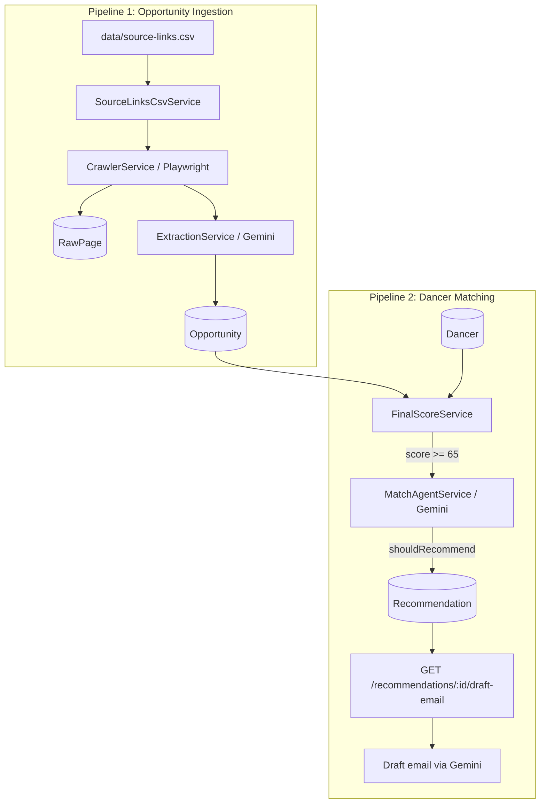

# Hammer-agent

AI-powered backend for discovering dance opportunities from the web, matching them to dancer profiles, and generating application drafts.

Built with **NestJS**, **Prisma (PostgreSQL)**, **Playwright**, and **LangChain + Google Gemini**.

---

## Overview

Hammer-agent runs two main pipelines:

1. **Ingestion pipeline** — import source URLs → crawl pages → extract structured opportunities with AI → persist to database.
2. **Matching pipeline** — score opportunity–dancer pairs with deterministic rules → validate with an AI match analyst → save recommendations → optionally draft application emails via API.



---

## Tech Stack

| Layer       | Technology                                             |
| ----------- | ------------------------------------------------------ |
| Framework   | NestJS 11                                              |
| Database    | PostgreSQL + Prisma 7                                  |
| Crawling    | Playwright (headless Chromium)                         |
| AI          | LangChain + `@langchain/google` (Gemini 2.5 Flash)     |
| Validation  | Zod schemas for structured LLM output                  |
| CLI scripts | Compiled Nest context (`nest build` + `node dist/...`) |

---

## Project Structure

```
src/
├── pipeLine/              # Orchestrates ingestion end-to-end
│   └── opportunity-ingestion.service.ts
├── source-links/          # CSV import, source link CRUD
├── crawler/               # Playwright page fetch + RawPage persistence
├── extraction/            # AI agent: page text → structured opportunities
├── opportunity/           # Save, dedupe, completeness scoring, JSON export
├── matching/              # Rule-based scoring + AI match analyst
│   ├── scoring/           # Style, location, type, availability, experience, compensation
│   ├── tools/             # LangChain tools (get opportunity/dancer, calculate score)
│   └── match-agent.service.ts
├── recommendations/       # Upsert recommendations + draft-email API
├── prisma/                # PrismaService (Pg adapter)
├── common/
│   ├── schemas/           # Zod schemas for LLM structured output
│   └── utils/
└── scripts/
    ├── crawl-opportunities.ts   # CLI: run ingestion pipeline
    ├── match-opportunities.ts   # CLI: run matching pipeline
    └── seed-dancers.ts          # CLI: seed dancer profiles

prisma/
├── schema.prisma
└── seed/seed-dancer.ts    # Seed data (Rin, Justin)

data/
└── source-links.csv       # Curated dance opportunity sources

generated/
├── prisma/                # Generated Prisma client
└── opportunities.json     # Export snapshot from ingestion
```

---

## Data Model

| Model            | Role                                                              |
| ---------------- | ----------------------------------------------------------------- |
| `SourceLink`     | Curated URL to crawl (studio, academy, casting board, etc.)       |
| `RawPage`        | Crawled page snapshot (HTML, text, content hash) for audit        |
| `Opportunity`    | Structured job/casting extracted by AI; deduped by `canonicalKey` |
| `Dancer`         | Dancer profile (styles, location, experience, preferences)        |
| `Recommendation` | Opportunity ↔ Dancer match with scores, reason, risks, status     |

Opportunity status is set automatically:

- `complete` — `confidence >= 0.7` and `completenessScore >= 70`
- `incomplete` — otherwise

Only `complete` opportunities with contact info are eligible for matching.

---

## Pipeline 1: Opportunity Ingestion

**Entry:** `OpportunityIngestionService.run()`  
**CLI:** `npm run crawl:opportunities`

```
CSV import → select sources → for each source:
  1. Crawl URL (Playwright)
  2. Save RawPage
  3. Extract opportunities (Gemini + Zod schema)
  4. Save Opportunity (upsert by canonicalKey)
  5. Mark source crawl success/failure
→ Export opportunities.json
```

### Crawler (`CrawlerService`)

- Opens each source URL in headless Chromium.
- Waits for DOM + optional `networkidle`.
- Extracts title, HTML, and cleaned body text.
- Stores a content hash to detect page changes.

### Extraction Agent (`ExtractionService`)

- Model: **Gemini 2.5 Flash** with structured output (`DanceOpportunityExtractionResultSchema`).
- Input: source metadata + truncated page text (max ~14k chars).
- Output: array of opportunities (title, organization, styles, location, requirements, compensation, contact, dates, confidence, missingFields).
- Rules: do not invent data; only extract actionable dance jobs/castings/auditions.

### Opportunity Persistence (`OpportunityService`)

- Computes `completenessScore` from required fields.
- Builds `canonicalKey` (hash of title, org, location, dates) for deduplication.
- Upserts into PostgreSQL.

---

## Pipeline 2: Dancer Matching

**Entry:** `MatchingService.matchOpportunityToDancers()` / `matchAllCompleteOpportunities()`  
**CLI:** `npm run match:opportunities`

```
For each complete opportunity × each active dancer:
  1. Hard filters (FinalScoreService)
  2. Weighted score calculation
  3. Skip if score < 65
  4. AI match analysis (MatchAgentService)
  5. Skip if shouldRecommend = false
  6. Upsert Recommendation
```

### Step 1 — Deterministic Scoring (`FinalScoreService`)

**Hard filters** (must all pass):

- Opportunity has application URL, email, or phone
- Deadline not passed
- Dancer is active
- Opportunity has city or country
- At least one overlapping dance style

**Weighted sub-scores:**

| Dimension                              | Weight |
| -------------------------------------- | ------ |
| Dance style overlap                    | 35%    |
| Location / travel radius               | 20%    |
| Opportunity type vs dancer preferences | 15%    |
| Availability vs deadline/event         | 10%    |
| Experience / skill level               | 10%    |
| Compensation fit                       | 10%    |

Pairs with `finalScore < 65` are discarded before AI review.

### Step 2 — AI Match Analyst (`MatchAgentService`)

- Model: **Gemini 2.5 Flash** with `MatchAnalysisSchema`.
- Receives opportunity, dancer profile, and pre-calculated scores.
- Returns: `shouldRecommend`, `reason`, `risks[]`, `suggestedMessage`.
- Rules: must not recalculate scores; must not invent missing data; reject if hard filter failed or score < 65.

### Step 3 — Recommendation (`RecommendationsService`)

- Upserts by `(opportunityId, dancerId)`.
- Stores all sub-scores, merged risks, reason, and suggested message.
- Default status: `pending_review`.

### LangChain Tools (prepared for agent expansion)

| Tool                    | Purpose                              |
| ----------------------- | ------------------------------------ |
| `get_opportunity`       | Fetch opportunity by ID              |
| `get_dancer`            | Fetch dancer by ID                   |
| `calculate_match_score` | Run deterministic scoring for a pair |

---

## Pipeline 3: Draft Application Email

**API:** `GET /api/v1/recommendations/:id/draft-email`

- Loads recommendation with linked opportunity and dancer.
- Calls Gemini with `DraftEmailSchema` to generate a copy-paste-ready application message.
- Rules: use only provided data; no invented credentials; professional tone.

```bash
curl http://localhost:8080/api/v1/recommendations/<recommendation-id>/draft-email
```

---

## Environment Variables

Copy `.env.example` to `.env`:

```env
DATABASE_URL=postgresql://...
PORT=8080
GOOGLE_API_KEY=your-gemini-api-key

# Optional: LangSmith tracing
LANGSMITH_TRACING=true
LANGSMITH_ENDPOINT=https://api.smith.langchain.com
LANGSMITH_API_KEY=
LANGSMITH_PROJECT=
```

---

## Setup

```bash
npm install
npx prisma generate
npx prisma migrate dev
npm run db:seed          # seed sample dancers (Rin, Justin)
npm run start:dev        # API on http://localhost:8080
```

---

## CLI Scripts

| Command                                                                | Description                                            |
| ---------------------------------------------------------------------- | ------------------------------------------------------ |
| `npm run crawl:opportunities -- --csv data/source-links.csv --limit 3` | Run full ingestion pipeline                            |
| `npm run match:opportunities`                                          | Match all complete opportunities to all active dancers |
| `npm run match:opportunities -- --opportunityId <uuid>`                | Match one opportunity                                  |
| `npm run db:seed`                                                      | Seed dancer profiles                                   |

Scripts require `nest build` first (handled automatically by npm scripts).

---

## API

Base URL: `http://localhost:8080/api/v1`

| Method | Path                               | Description                                           |
| ------ | ---------------------------------- | ----------------------------------------------------- |
| `GET`  | `/recommendations/:id/draft-email` | Generate draft application email for a recommendation |

---

## Design Principles

- **Crawl first, AI second** — raw pages are stored for audit; LLMs only process extracted text, not live browsing.
- **Rules before AI** — deterministic scoring filters noise; Gemini validates and explains, not replaces business logic.
- **Structured output** — all AI agents use Zod schemas via `withStructuredOutput` for type-safe responses.
- **No hallucination policy** — prompts explicitly forbid inventing missing fields across extraction, matching, and email drafting.

---

## License

UNLICENSED — private project.
